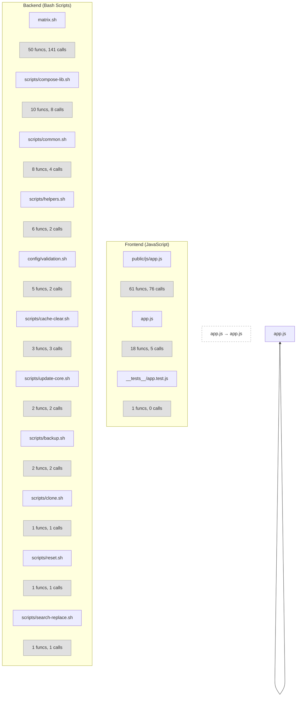

# Code Architecture Diagram

Shows only code/source files (`.js`, `.sh`) — excludes planning docs and markdown.

## Code File Summary

| File | Functions | Calls | Community |
|------|-----------|-------|-----------|
| frontend/public/js/app.js | [object Object],[object Object],[object Object],[object Object],[object Object],[object Object],[object Object],[object Object],[object Object],[object Object],[object Object],[object Object],[object Object],[object Object],[object Object],[object Object],[object Object],[object Object],[object Object],[object Object],[object Object],[object Object],[object Object],[object Object],[object Object],[object Object],[object Object],[object Object],[object Object],[object Object],[object Object],[object Object],[object Object],[object Object],[object Object],[object Object],[object Object],[object Object],[object Object],[object Object],[object Object],[object Object],[object Object],[object Object],[object Object],[object Object],[object Object],[object Object],[object Object],[object Object],[object Object],[object Object],[object Object],[object Object],[object Object],[object Object],[object Object],[object Object],[object Object],[object Object],[object Object] | undefined | 0 |
| scripts/graphify-shim/matrix.sh | [object Object],[object Object],[object Object],[object Object],[object Object],[object Object],[object Object],[object Object],[object Object],[object Object],[object Object],[object Object],[object Object],[object Object],[object Object],[object Object],[object Object],[object Object],[object Object],[object Object],[object Object],[object Object],[object Object],[object Object],[object Object],[object Object],[object Object],[object Object],[object Object],[object Object],[object Object],[object Object],[object Object],[object Object],[object Object],[object Object],[object Object],[object Object],[object Object],[object Object],[object Object],[object Object],[object Object],[object Object],[object Object],[object Object],[object Object],[object Object],[object Object],[object Object] | undefined | 1 |
| frontend/app.js | [object Object],[object Object],[object Object],[object Object],[object Object],[object Object],[object Object],[object Object],[object Object],[object Object],[object Object],[object Object],[object Object],[object Object],[object Object],[object Object],[object Object],[object Object] | undefined | 2 |
| scripts/compose-lib.sh | [object Object],[object Object],[object Object],[object Object],[object Object],[object Object],[object Object],[object Object],[object Object],[object Object] | undefined | 28 |
| scripts/common.sh | [object Object],[object Object],[object Object],[object Object],[object Object],[object Object],[object Object],[object Object] | undefined | 34 |
| scripts/helpers.sh | [object Object],[object Object],[object Object],[object Object],[object Object],[object Object] | undefined | 43 |
| config/validation.sh | [object Object],[object Object],[object Object],[object Object],[object Object] | undefined | 52 |
| scripts/cache-clear.sh | [object Object],[object Object],[object Object] | undefined | 62 |
| scripts/update-core.sh | [object Object],[object Object] | undefined | 71 |
| scripts/backup.sh | [object Object],[object Object] | undefined | 70 |
| frontend/__tests__/app.test.js | [object Object] | undefined | 23 |
| scripts/clone.sh | [object Object] | undefined | 78 |
| scripts/reset.sh | [object Object] | undefined | 79 |
| scripts/search-replace.sh | [object Object] | undefined | 80 |